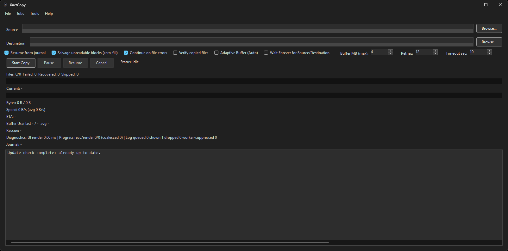
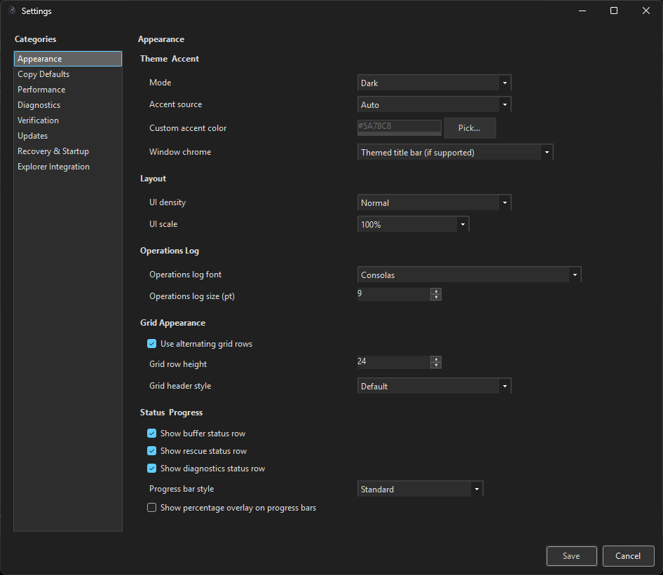

# XactCopy

XactCopy is a VB.NET WinForms copier built for resilient transfers on unstable storage media.

## License

GNU GPL v3.0. See `LICENSE`.

## Highlights

- Out-of-process worker process with supervisor restart handling.
- Journal-based resume and recovery after unexpected exits.
- Scan-only bad-block detection mode (`Scan Bad Blocks`) with reusable bad-range maps.
- Pause/resume/cancel controls with run-state persistence.
- Salvage mode for unreadable sectors with configurable fill pattern.
- Retry/backoff timeout controls for degraded disks.
- Adaptive buffer mode with live speed, ETA, and buffer telemetry.
- AegisRescueCore multi-pass recovery pipeline with tunable pass parameters.
- Job manager (saved jobs, queue, history).
- Explorer context menu integration (`Copy with XactCopy`).
- Dark/system/classic theme support.
- Built-in updater with download and in-place apply flow.

## Screenshots

### Main Window



### Settings (Appearance)



## Repository Layout

- `src/XactCopy.UI` WinForms GUI, theme, settings, shell integration.
- `src/XactCopy.Worker` Copy execution worker process.
- `src/XactCopy.Core` Shared models, options, protocol contracts.
- `src/XactCopy.Storage` Journals and persistent state storage.
- `tests/XactCopy.Tests` Unit tests.

## Build

Requires .NET 10 SDK.

```powershell
dotnet build XactCopy.slnx
dotnet test XactCopy.slnx
dotnet run --project src/XactCopy.UI/XactCopy.UI.vbproj
```

## Publish (Windows x64)

```powershell
dotnet publish src/XactCopy.UI/XactCopy.UI.vbproj -c Release -r win-x64 --self-contained false -o artifacts/publish/win-x64
```

## Versioning

- A monotonic build counter is stored in `src/XactCopy.UI/BuildVersion.txt`.
- Each build increments the counter.
- Version is computed as `Major.Minor.Patch.Revision`:
- `Major` increments every 1000 builds (base major starts at `1`).
- `Minor` increments every 100 builds.
- `Patch` increments every 10 builds.
- `Revision` is the last digit of the build counter.

## Release

- Changelog entries: `CHANGELOG.md`
- Release process notes: `docs/RELEASE_PROCESS.md`
- Architecture overview: `ARCHITECTURE.md`
- Contribution guide: `CONTRIBUTING.md`

## Brief Version History

- `v1.0.8.1` Added severity color-coding for the operations log (with settings toggle), moved destination metadata checks to a Win32 fast path, and hardened cancel/IPC recovery so malformed stream states no longer leave runs stuck waiting for cancellation acknowledgement.
- `v1.0.7.0` Improved scan performance for tiny-file workloads by adding a dedicated scan small-file fast path and batching bad-range-map writes during scan runs.
- `v1.0.6.8` Fixed operations log rendering after completing one job and starting another by hard-resetting pending log queues and forcing a safe virtual-list redraw path.
- `v1.0.6.7` Fixed updater cleanup so extracted package artifacts (including wrapper folders like `win-x64`) and temporary staging/script files are removed after update apply/restart.
- `v1.0.6.5` Hardened startup initialization to avoid `SetCompatibleTextRenderingDefault` ordering crashes during edge restart/recovery conditions.
- `v1.0.6.3` Performed a focused codebase comment pass and refreshed project documentation (`ARCHITECTURE`, `README`, `CONTRIBUTING`, and release process docs) to match current scan-mode, bad-range-map, and resiliency behavior.
- `v1.0.6.2` Added scan-only bad-block mode with reusable bad-range maps, fixed scan/copy mode separation bugs, preserved drive-root path normalization (`D:\`), and updated title-bar mode text to show `Scanning` during scan runs.
- `v1.0.5.9` Hardened journal integrity with signed hash-chained ledger records, multi-generation backups, mirrored snapshots, trust/sequence-aware recovery fallback, and legacy journal compatibility retention.
- `v1.0.5.8` Added advanced resilience hardening: remap-and-resume from existing journals after path/media failures, configurable lock/AV contention handling, policy-based source-mutation behavior (fail/skip/wait), and serial-based media identity matching that is safer across drive-letter remaps.
- `v1.0.5.0` Added a major worker performance milestone with handle-based `RandomAccess` chunk I/O, adaptive and reverse-direction rescue passes, and a dedicated small-file fast path for lower overhead and steadier throughput.
- `v1.0.4.9` Optimized worker copy throughput by pooling hot-path buffers, reusing per-file transfer streams, and reducing retry-path allocation/stream churn for smoother sustained transfers.
- `v1.0.4.8` Optimized UI responsiveness with faster Settings rendering (no dark-mode opening flash) and a virtualized high-performance Job Manager grid with debounced filtering and faster details lookup.
- `v1.0.4.7` Introduced the advanced jobs-system revamp (schema-based queue entries, migration from legacy queue IDs, richer queue/run APIs), shipped a redesigned single-grid Jobs Console with filtering/details/actions, and fixed Job Manager spacing/splitter/button alignment issues.
- `v1.0.4.1` Added `Always ask for each conflict` overwrite policy with per-file prompts, fixed repeated Explorer context-menu enable logs on settings save, and corrected source/destination textbox wrapper rendering.
- `v1.0.4.0` Added a new ClawHammer-style About dialog with updated XactCopy branding/logo, author attribution, centered version banner text, and a live system info snapshot.
- `v1.0.3.7` Added README screenshots for main window and appearance settings, with image assets now tracked under `docs/screenshots`.
- `v1.0.3.6` Added diagnostics + worker telemetry controls, virtualized and throttled runtime log rendering, expanded appearance customization (accent/density/scale/grid/progress/status rows/window chrome), explorer-launch destination prompt, and restart guidance for UI settings.
- `v1.0.2.7` Settings now use live dirty-state save enablement, detect restart-required changes (including theme), and prompt to restart with safe defer behavior during active runs.
- `v1.0.2.4` Added `AegisRescueCore` multi-pass rescue with range-aware journal resume, rescue telemetry/tuning, event-focused logging, and fixed high-speed UI progress rendering/finalization accuracy.
- `v1.0.1.3` Fixed updater apply hang on `Canceling...` and improved release notes formatting in the update dialog.
- `v1.0.0.9` Updater upgraded to download/apply releases in-app with progress, replacing page-only update prompts.
- `v1.0.0.7` Worker renamed to `XactCopyExecutive`, shared app icon applied to worker, and standalone worker startup hardened.
- `v1.0.0.3` Default update URL now targets XactCopy latest GitHub release endpoint.
- `v1.0.0.1` Initial public release with resilient worker, journal recovery, telemetry, settings, and Explorer integration.

## Notes

- Salvage mode can keep a copy moving, but unreadable source bytes are replaced by the selected fill pattern.
- Verification is skipped for salvaged file regions by design.
- No copier can guarantee recovery from every hardware or OS failure mode.
