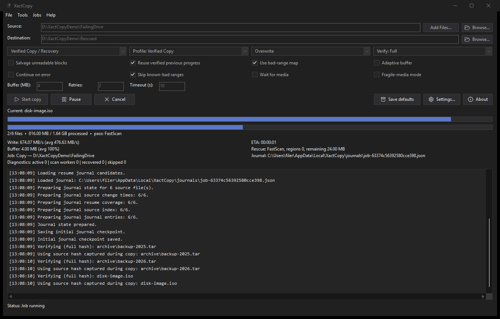
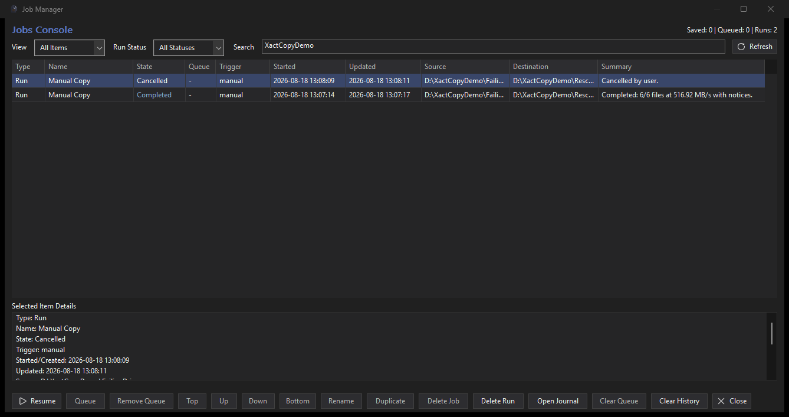
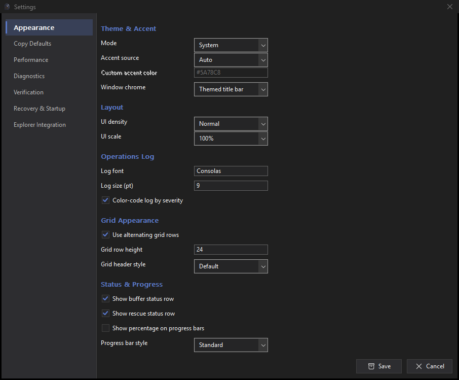
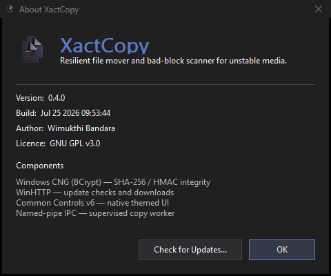
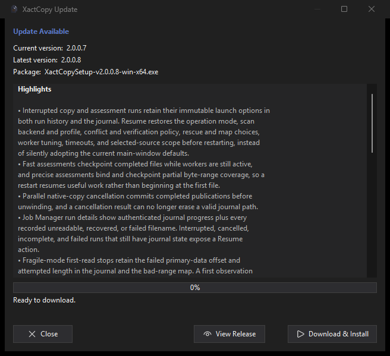

# XactCopy User Guide

Everything XactCopy does, option by option. If you only want to get going, the
Quick Start in the [README](../README.md) is enough.

## Contents

- [The main window](#the-main-window)
- [Copy mode](#copy-mode)
- [Assess Readable Files mode](#assess-readable-files-mode)
- [Resilience options](#resilience-options)
- [Verification](#verification)
- [Bad-range maps](#bad-range-maps)
- [The Job Manager](#the-job-manager)
- [Crash recovery](#crash-recovery)
- [Explorer integration](#explorer-integration)
- [Settings](#settings)
- [Updates](#updates)
- [Menu reference](#menu-reference)
- [Command line](#command-line)
- [Where XactCopy stores its data](#where-xactcopy-stores-its-data)

## The main window

Pick a **Source** and **Destination** with *Browse…*, or type or paste a path.
*Add Files…* opens a multi-select picker, and files or folders dropped onto the
window are added the same way. When a specific set of items is selected rather
than a whole folder, a summary line appears under the source box — for example
*"3 items selected (2 files, 1 folder) — only these will be copied"* — with a
**Clear** button. Choosing a source folder with *Browse* clears the selection and
copies the whole folder again.

Below the paths are four mode-sensitive combos. Copy mode shows **Profile**,
conflict policy, and verification; assessment mode shows scan profile, read
backend, and whether findings are saved. The resilience toggles and numeric
tuning fields follow.

The main-window values are per-run overrides. Click **Save defaults**, or use
**Tools -> Save Current Settings as Defaults**, to persist the reusable engine,
overwrite, verification, resilience, buffer, retry, and timeout choices for
future runs. The selected mode, source, destination, and journal remain
per-run; use **Jobs -> Save Current Options As Job...** when an exact job
profile should be retained.

While a job runs the window shows:

- Two progress bars: the current file and the job overall.
- A counter line: files done, bytes done, and the current rescue pass.
- Throughput with a running average, an **ETA**, buffer utilisation, and
  rescue-pass telemetry.
- A **Journal** path for the run, and a diagnostics row.
- A live, severity-coloured operations log.

The operations log has vertical and horizontal scroll bars, so long paths,
journal details, and diagnostic messages can be inspected without being
truncated.

During a run, **Pause** and **Cancel** remain available while job inputs lock.
The first Cancel requests cooperative shutdown; a second click force-stops a
worker that is stuck inside a Windows or device I/O call.

## Copy mode

Copies everything under **Source** into **Destination**, resiliently.

**Profile** applies a coherent starting policy:

| Profile | Behaviour |
| --- | --- |
| **Verified Copy** *(default)* | Full verification, conservative retries, and no synthetic salvage or continue-on-error policy. |
| **Recover Media** | Managed rescue, fragile/adaptive behavior, map updates, and non-exact sidecar publication for failing media. |
| **Custom** | Uses the detailed engine and policy defaults from Settings. Editing a profile-controlled main-window option switches the run to Custom. |

**Overwrite** controls what happens when a destination file already exists:

| Choice | Behaviour |
| --- | --- |
| **Overwrite** | Always replace the destination file |
| **Skip existing** | Never touch an existing destination file |
| **Overwrite if newer** | Replace only when the source is newer |
| **Stop on conflict** | Leave the existing file untouched and report the run as incomplete. |

## Assess Readable Files mode

Reads allocated files beneath **Source** without writing a destination and
records unreadable file-relative ranges. It does not inspect free space or
unallocated sectors and is not a whole-disk health verdict. No destination is
required.

On actively deteriorating hardware, recover the highest-value data first. An
assessment performs an additional pass over the source and may spend limited
device life without copying any bytes. Assess first only when the medium is
stable enough and the map will be reused across later recovery passes.

Scanning runs in a precise profile or a faster parallel one (**Settings →
Performance → Scan profile**); the fast profile falls back to precise reads
around any fault it finds, so the resulting map stays accurate.

The three assessment combos choose **Auto/Fast/Precise**, **Standard file
reads/Raw NTFS extents**, and whether this run updates the bad-range map. Raw
extent reads require administrator access; choosing them without elevation
produces a visible fallback to standard file reads rather than a false raw-scan
claim.

## Resilience options

These toggles shape how XactCopy handles trouble.

| Option | What it does |
| --- | --- |
| **Salvage unreadable blocks** | When a region can't be read cleanly, preserve readable ranges and fill isolated unreadable ranges deterministically. The run is **Incomplete**, not successful. Non-exact output preserves the original extension and receives an adjacent `.recovery.json` manifest unless the expert overwrite override is enabled. |
| **Resume from journal** | Continue an interrupted job from its journal instead of restarting. On by default; every job is journaled either way. |
| **Use bad-range map** | Consult a saved map of known-bad regions for this source. Updating the map is a separate default under Settings. See [Bad-range maps](#bad-range-maps). |
| **Skip known-bad ranges** | Don't re-read ranges that have the same file/media identity and were observed bad in at least two matching scans. This makes a later pass faster without trusting a one-off error. |
| **Adaptive buffer** | Size the read buffer dynamically from measured throughput and latency, backing off on slow or high-latency media. |
| **Continue on error** | Keep going past a file that ultimately can't be copied. Earlier files may already have been atomically published, so the destination can contain a mixed, incomplete generation; the run cannot be a clean success. |
| **Wait for media** | If the source or destination disappears — a drive spins down, a disc is ejected — pause and wait for it to come back rather than failing. |
| **Fragile-media mode** | Minimise stress on a dying drive: gentler retry timing and access patterns, trading speed for a better chance of getting the data off before the drive fails completely. |

**Buffer (MB)**, **Retries**, and **Timeout (s)** set the read buffer size, the
number of XactCopy-level retries, and how long an operation may stall before it
counts as failed. Windows, the filesystem, and the storage device may already
perform lower-level retries before an API call returns an error; XactCopy's
retry count is additional work. The safe default is 2 and the enforced maximum
is 32. Keep the count low on mechanically failing or heat-sensitive media.

### Rescue passes

When the engine hits damage it runs a sequence of *rescue passes* over the
affected regions: fast sweeps first, then progressively more aggressive
strategies — forward and reverse trim sweeps, fine-grained scraping, and targeted
retries of the worst spots — splitting failing ranges and adapting to the density
of errors. The rescue telemetry line reports the current pass, how many regions
remain, and the bytes still outstanding.

## Verification

**Verify** checks that what landed at the destination matches the source:

| Mode | Behaviour |
| --- | --- |
| **None** | No post-copy content check. This is an attended-only choice because a successful Windows copy call is not proof against every source, cable, RAM, or destination corruption mode. |
| **Sampled** | Hash representative ranges. Faster, but corruption outside the samples can be missed; this is also attended-only. |
| **Full** | Hash the complete default data stream and copied alternate data streams. This is the integrity-first default and is required for unattended copy/resume. |

The hash algorithm (SHA-256 or SHA-512) and the sampling chunk size and count are
set under **Settings → Verification**. Verification runs after the data is
written, and any mismatch is reported in the log and the job summary.

## Publication and filesystem fidelity

Each destination file is built beside its final path, verified and flushed,
then published with a same-volume atomic rename. A failed read, write, flush, or
verification therefore leaves an existing destination file intact. This is a
**per-file** transaction, not a transaction for the whole folder: if a later
file fails, earlier verified files remain committed. Continue on error makes
that mixed-generation outcome more likely and always produces an incomplete
run when any source item is lost.

XactCopy preserves file timestamps, basic attributes, DACLs, alternate data
streams, and (when enabled) child-directory timestamps/basic attributes/DACLs.
Owner/group and SACL preservation can require privileges and is reported when
incomplete. EFS encryption is preserved or the file fails unless plaintext was
explicitly allowed. NTFS hard-linked names currently become independent exact
files, and directory alternate streams are not copied; both limitations are
reported. Managed Rescue also reports filesystem features such as sparse or
compressed layout that it cannot reproduce exactly.

## Bad-range maps

A **bad-range map** records which byte ranges of a particular source file are
unreadable. Build one with **Assess Readable Files**, or let a copy populate it as it
goes. On later runs, enable **Use bad-range map** and **Skip known-bad ranges** so
XactCopy spends its effort on recoverable data instead of grinding on sectors it
already knows are dead.

Maps are signed, age-limited, and bound to the source volume plus each file's
identity, size, last-write time, NTFS change time, and fingerprint. A skip hint
is trusted only after the same bad range is observed twice. Synthetic
salvage-filled ranges are not promoted into future skip hints. **Settings → Copy
Defaults** controls whether runs update the map and how old a map may be before
it is ignored.

## The Job Manager

**Jobs → Job Manager…** opens the Jobs Console: saved jobs, the run queue, and
run history in one grid.

- **Saved jobs** — save a configured copy or scan as a named job (**Jobs → Save
  Current Options As Job…**), then run, rename, duplicate, or delete it.
- **Queue** — line jobs up to run back-to-back; reorder with Top/Up/Down/Bottom,
  or clear the queue. Queued jobs can run automatically at startup (**Settings →
  Recovery & Startup**). Automatic execution requires bound source/destination
  media identities, full verification, Continue on error off, and both
  recovered-overwrite/plaintext expert overrides off. Jobs outside that policy
  remain available for a reviewed manual run.
- **History** — every run is recorded with its type, state (Running, Completed,
  Failed, Cancelled, Interrupted…), timings, source and destination, and a
  summary. **Open Journal** validates the run's journal, exports a readable JSON
  view, and opens that view. Large resumable journals use XactCopy's compressed
  `XCJZ` container internally even though their compatibility filename ends in
  `.json`; this is expected, not encryption or corruption.

Filter with the **View** and **Run Status** combos or the **Search** box. The
grid refreshes automatically; double-click a run to open its journal, and use
<kbd>Del</kbd>, <kbd>F5</kbd>, and <kbd>Enter</kbd> as shortcuts.

## Crash recovery

Because every run is journaled, XactCopy can recover from an unclean shutdown. If
a run was active when XactCopy or Windows went down, the next launch detects the
interrupted run and offers to **Resume** it — continuing from the journal —
**Discard** it, or decide **Later**.

**Settings → Recovery & Startup** controls whether you are prompted, whether
interrupted runs resume automatically, whether the prompt keeps reappearing until
resolved, and whether XactCopy restarts itself at the next logon after an
interruption. Auto-resume uses the same strict unattended policy as the queue;
otherwise XactCopy requires a person to review and confirm the run.

## Explorer integration

Enable **Settings → Explorer Integration** to add XactCopy to the Windows shell:

- **Copy with XactCopy** — on files, folders, drives, and folder backgrounds. A
  selected item is shown as the exact source and only that item is copied.
  Multi-select copies the selected items together from their shared source
  folder. The folder-background command copies the whole folder.
- **Assess Readable Files with XactCopy** — on folders and drives; opens XactCopy
  ready to scan that target.
- **Open with / drag-and-drop** — XactCopy is registered as an application, so
  you can drop files onto it or pick it from *Open with*.
- **Send to → XactCopy**, and a **Run** dialog entry (`XactCopy`).

All shell entries are per-user and are removed cleanly when you turn the option
off. Launching from Explorer while XactCopy is already running hands the
selection to the running window rather than starting a second copy.

## Settings

**Tools → Settings…** opens seven pages. Everything here sets *defaults* for new
jobs; the main window's controls override them per run.

### Appearance

Theme mode (Dark, Light, System, Classic), accent source (Auto, System, Custom)
and a custom accent colour, and window chrome (themed or standard title bar).
Layout covers UI density and 50–250% application scale in addition to each
monitor's Windows DPI. The Operations Log section sets the log font, size, and
severity colouring. Grid Appearance covers alternating rows, row height, and
header style. Status & Progress toggles the buffer and rescue status rows,
percentage text on progress bars, and distinct thin, standard, or thick progress
bars.

### Copy Defaults

Default run behaviour — resume from journal, salvage, continue on file errors,
preserve source timestamps, copy empty directories, wait for source/destination,
wait for lock release, and whether *Access Denied* counts as contention.

Policies — overwrite policy, symlink handling (skip or follow), and the
deterministic fill pattern used for unrecoverable bytes (zero or `0xFF`). Legacy
jobs that request random fill are rejected because non-deterministic bytes make
recovery boundaries harder to audit.

Expert integrity overrides permit synthetic recovered bytes to replace an
existing destination or permit an EFS-encrypted source to become plaintext.
Both are off by default, require confirmation for a manual run, and are blocked
for unattended execution. Without the first override, recovery output always
uses a visibly named sidecar. Without the second, EFS encryption must be
preserved or the file fails safely.

Bad Range Map — whether maps are used and updated, whether known-bad ranges are
skipped, and the maximum age of a map before it is ignored. **Raw volume scan**
reads allocated file extents directly from a local NTFS
volume when XactCopy is running elevated. It remains scan-only, does not scan
free or unallocated space, and automatically falls back to standard file reads
for unsupported layouts or unavailable raw access.

### Performance

Transfer tuning — adaptive buffer, transfer engine policy, scan profile, worker
process priority, manual buffer size, retry count, operation and per-file
timeouts, a throughput cap, small-file worker count and threshold, and scan
worker count.
With worker count set to `0` (Auto), seek-based disks use one worker while
non-seek storage uses up to eight based on processor count. Explicit values up
to 64 remain available for measured expert tuning.

Fragile Media Guard — enable fragile mode by default, skip a file on the first
read error, persist those skips across a resume, and the failure window,
threshold, and cooldown that trigger the guard.

Contention & Source Mutation — lock-probe interval, and what to do when the
source changes mid-run (fail the file, skip it, or wait for it to reappear).

Rescue Engine Tuning — per-pass chunk sizes (FastScan, TrimSweep, Scrape,
RetryBad), the minimum split size, and per-pass retry counts. `0` means *auto*
for each; leave these alone unless you are tuning for a specific drive.

### Diagnostics

Worker telemetry profile (Normal, Verbose, Debug), progress interval, and a log
rate cap. UI diagnostics strip and its refresh interval, and the maximum number
of lines the log keeps. Journal storage — whether backups are discarded when a
run completes, how long journals are kept, and how many are always retained.

### Verification

Whether verification is on by default, full or sampled mode, SHA-256 or SHA-512,
and the sampled-mode chunk size and count.

### Recovery & Startup

Auto-start at the next logon after an interruption, automatically run queued jobs
at startup, prompt to resume interrupted runs, auto-resume without prompting,
keep prompting until resolved, and the heartbeat write interval.

### Explorer Integration

A single switch for the shell entries described in
[Explorer integration](#explorer-integration).

Settings are stored as JSON. Unknown keys are preserved, so a newer and an older
build can share the same file without either losing settings. Existing explicit
values are not silently rewritten during an upgrade. If they reduce integrity
(for example Verify: None or Continue on error), XactCopy shows an attended-run
confirmation and prevents them from being used by automatic queue/recovery.

## Updates

**Help → About XactCopy** shows the exact version and build — the two things any
bug report needs — along with the **Check automatically** switch that decides
whether XactCopy looks for updates on launch.

**Check for Updates…** there, or **Tools → Check for Updates…**, asks GitHub for
the latest release now.

If a newer version exists, XactCopy shows the release notes and the package name.
**Download & Install** downloads the package, verifies it against its published
SHA-256, and applies it in place, after which XactCopy restarts on the new
version. **View Release** opens the release page in your browser instead.

XactCopy will not install a package it cannot check: if no SHA-256 is published
for the release asset, the update is refused rather than applied unverified.
Release feeds and assets must use HTTPS, truncated/oversized downloads are
rejected, and only an exact XactCopy Windows x64 installer or portable package
is eligible. Portable ZIPs are path-validated, version-checked, backed up at the
package-file level, and rolled back if replacement or post-copy validation
fails. Packages larger than 2 GiB, archive path traversal, Windows reserved
device names, trailing-dot/space aliases, and case-insensitive duplicate paths
are rejected. Downloads and extraction use a random private temporary folder
that is removed without traversing reparse points. Portable application also
refuses reparse points beneath the install folder and verifies every installed
package file against the extracted SHA-256 before restarting.

## Menu reference

| Menu | Items |
| --- | --- |
| **File** | Start / Pause / Resume / Cancel Operation · Open Journal Folder · Open Crash Folder · Exit |
| **Tools** | Assess Readable Files… · Inspect/Clear Source Bad-Range Map… · Settings… · Save Current Settings as Defaults · Check for Updates… |
| **Jobs** | Save Current Options As Job… · Job Manager… · Resume Interrupted Job · Run Next Queued Job |
| **Help** | About XactCopy |

## Command line

`XactCopy.exe` accepts the switches the Explorer verbs use. They are documented
here because they are also useful for scripting; there is no separate console
interface.

| Switch | Effect |
| --- | --- |
| `--source <path>` | Set the source folder. |
| `--from-explorer <path> [<path>…]` | Copy exactly these items. Their shared parent becomes the internal copy root. |
| `--from-explorer-folder <path>` | Copy the whole folder (what the folder-background verb uses). |
| `--scan-from-explorer <path> [<path>…]` | Open in Assess Readable Files mode targeting these items. |
| `--resume-interrupted` | Show the resume prompt for an interrupted run on launch. Also accepted as `--force-resume-prompt`. |
| `--recovery-autostart` | Marks the launch as the post-interruption auto-start. Set by XactCopy itself; not meant to be typed. |

`--from-explorer`, `--scan-from-explorer`, and `--from-explorer-folder` also
accept the `=` form, e.g. `--from-explorer="D:\Recovery"`.

Only one instance runs at a time. Launching a second one forwards its arguments
to the running window and exits.

`XactCopyExecutive.exe` is the worker process. It takes `--pipe <name>` and is
started by `XactCopy.exe`; running it directly does nothing useful.

## Where XactCopy stores its data

Everything lives under `%LOCALAPPDATA%\XactCopy\`:

| Path | Contents |
| --- | --- |
| `journals\` | Per-run journals, their rotating backups, and mirrors; snapshots over 64 KB may be compressed XCJZ containers |
| `journal-views\` | Readable JSON views exported on demand by Job Manager's **Open Journal** action |
| `badmaps\` | Bad-range maps |
| `jobs\catalog.json` / `jobs-mirror\` | Signed saved jobs, queue, run history, rotations, and mirror |
| `runtime\recovery-state.json` | The active run and clean-shutdown marker |
| `security\` | HMAC keys — legacy-compatible raw journal key; current-user DPAPI-protected map/catalog keys |
| `settings.json` | Application settings |

**File → Open Journal Folder** opens `journals\` and **File → Open Crash Folder**
opens `runtime\`. Journals are HMAC-signed and hash-chained; bad-range maps and
the saved-job catalog use signed envelopes and trusted fallback snapshots. See
[ARCHITECTURE.md](ARCHITECTURE.md) for the formats.
